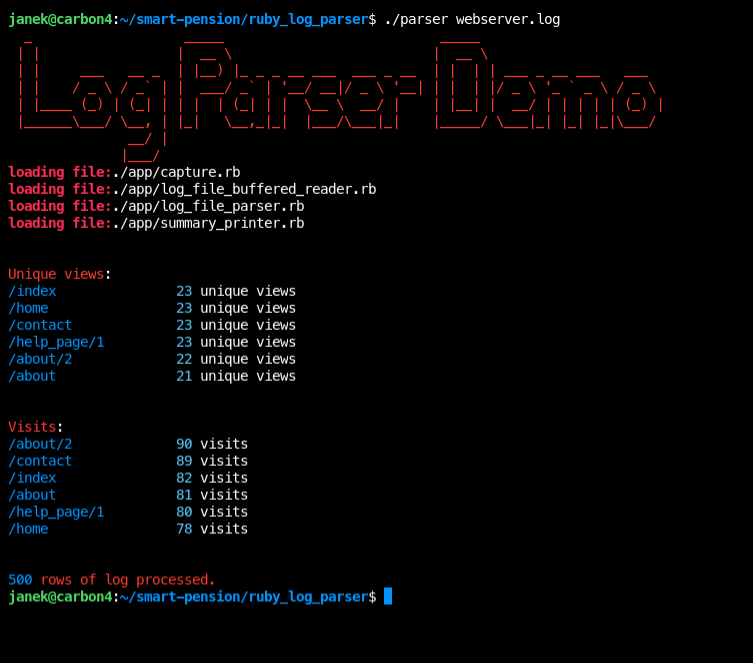

## What is it?

This is a recruitment task for Smart Pension



### Prep work

```
bundle install
chmod +x parser
```

### Run

```
./parser webserver.log
```

### Run tests


```
ruby test_suite.rb
```